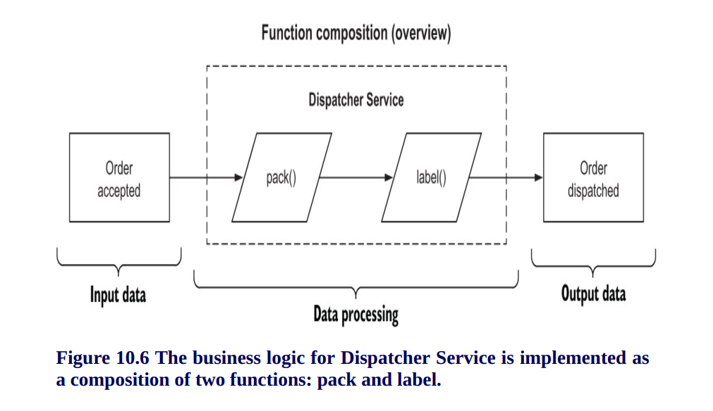
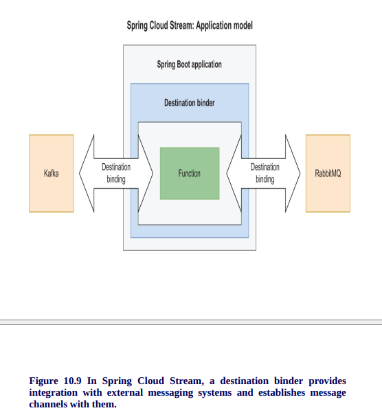

# Dispatcher Service

This application is part of the Polar Bookshop system and provides the functionality for dispatching orders.
It's part of the project built in the [Cloud Native Spring in Action](https://www.manning.com/books/cloud-native-spring-in-action) book
by [Thomas Vitale](https://www.thomasvitale.com).

## Useful Commands

| Gradle Command	         | Description                                   |
|:---------------------------|:----------------------------------------------|
| `./gradlew bootRun`        | Run the application.                          |
| `./gradlew build`          | Build the application.                        |
| `./gradlew test`           | Run tests.                                    |
| `./gradlew bootJar`        | Package the application as a JAR.             |
| `./gradlew bootBuildImage` | Package the application as a container image. |

After building the application, you can also run it from the Java CLI:

```bash
java -jar build/libs/dispatcher-service-0.0.1-SNAPSHOT.jar
```
# High level architecture


- Producer—The entity sending messages (publisher)
- Consumer—The entity receiving messages (subscriber)
- Message broker—The middleware accepting messages from producers and routing them to consumers


## Functions with Spring Cloud Function
- Supplier—A supplier is a function with only output, no input. It’s also
known as a producer, publisher, or source.
- Function—A function has both input and output. It’s also known as a
processor.
- Consumer—A consumer is a function with input but no output. It’s also
known as a subscriber or sink




## Configuring the integration with RabbitMQ
- Destination binder—The component providing the integration with
external messaging systems, like RabbitMQ or Kafka
- Destination binding—The bridge between the external messaging
  system entities, like queues and topics, and the application-provided
  producers and consumers
- Message—The data structure used by the application producers and
  consumers to communicate with the destination binders, and therefore
  with the external messaging systems



